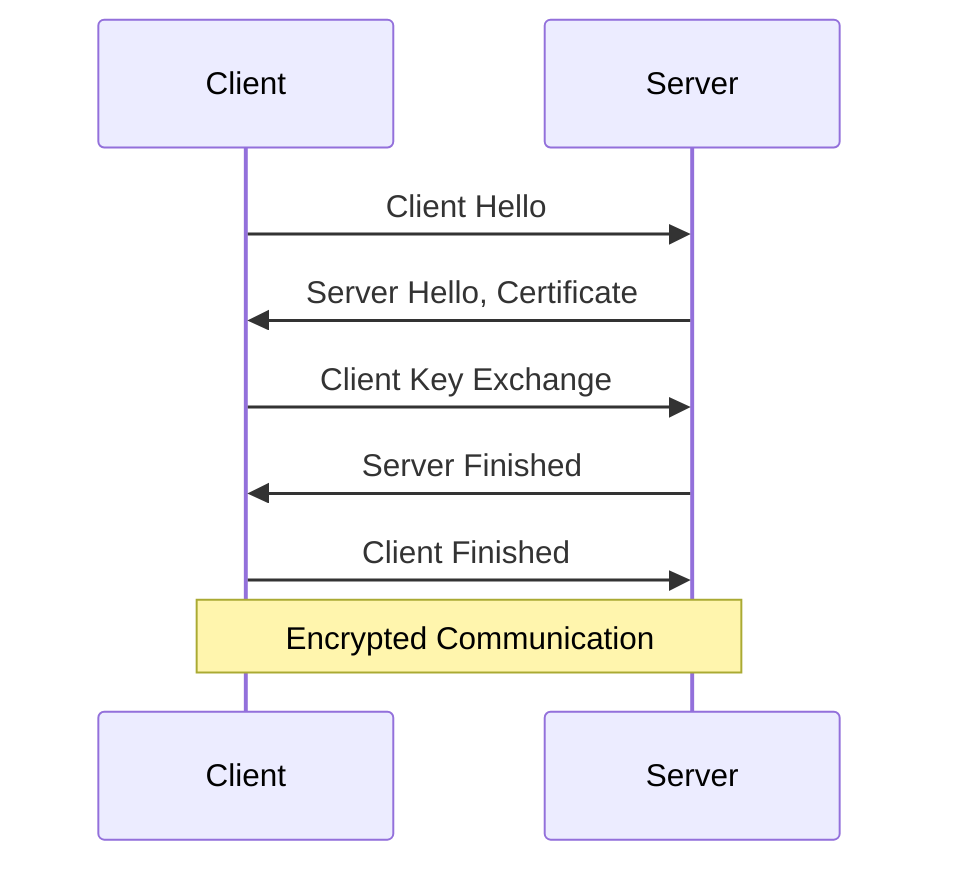

# Understanding HTTPS

Secure communication for the modern web

<div class="pt-12">
  <span @click="$slidev.nav.next" class="px-2 py-1 rounded cursor-pointer" hover="bg-white bg-opacity-10">
    Press Space for next page <carbon:arrow-right class="inline"/>
  </span>
</div>

<div class="abs-br m-6 flex gap-2">
  <a href="https://github.com/slidevjs/slidev" target="_blank" alt="GitHub"
    class="text-xl icon-btn opacity-50 !border-none !hover:text-white">
    <carbon-logo-github />
  </a>
</div>

---

# What is HTTPS?

HTTPS (Hypertext Transfer Protocol Secure) is an extension of HTTP

- 🔒 **Encrypted** - Secures the communication between client and server
- 🔐 **Authenticated** - Verifies the identity of the website
- 🛡️ **Integrity** - Prevents data tampering during transmission
- 🌐 **Standard** - The de facto standard for secure web communication
- 📈 **SEO** - Improves search engine rankings

<br>
<br>

Read more about [HTTPS on MDN](https://developer.mozilla.org/en-US/docs/Glossary/HTTPS)

---

# How HTTPS Works

<div grid="~ cols-2 gap-4">
<div>

1. **SSL/TLS Handshake**
   - Client and server agree on encryption algorithms
   - Server sends its SSL certificate
   - Client verifies the certificate

2. **Key Exchange**
   - A secure symmetric key is established

3. **Encrypted Communication**
   - Data is encrypted using the symmetric key
   - Secure data transfer begins

</div>
<div>



</div>
</div>

---

# Benefits of HTTPS

<v-clicks>

- **Data Privacy**: Protects sensitive information like passwords and credit card details
- **Data Integrity**: Prevents man-in-the-middle attacks and data tampering
- **Authentication**: Verifies the identity of the website you're connecting to
- **Trust**: Builds user confidence and improves brand reputation
- **SEO Boost**: Search engines favor HTTPS websites in rankings
- **New Features**: Enables modern web features like Service Workers and Progressive Web Apps

</v-clicks>

---

# Implementing HTTPS

<div grid="~ cols-2 gap-4">
<div>

1. **Obtain an SSL/TLS Certificate**
   - Use a trusted Certificate Authority (CA)
   - Consider using Let's Encrypt for free certificates

2. **Install the Certificate**
   - Configure your web server (e.g., Apache, Nginx)
   - Set up automatic renewal

3. **Update Your Website**
   - Change all URLs to use `https://`
   - Update internal links and resources

4. **Enable HSTS**
   - Implement HTTP Strict Transport Security
   - Forces HTTPS connections

</div>
<div>

```nginx
server {
    listen 443 ssl;
    server_name example.com;

    ssl_certificate /path/to/certificate.crt;
    ssl_certificate_key /path/to/certificate.key;

    ssl_protocols TLSv1.2 TLSv1.3;
    ssl_ciphers HIGH:!aNULL:!MD5;

    # ... other configurations ...
}
```

<div class="text-sm mt-4">
Example Nginx configuration for HTTPS
</div>

</div>
</div>

---
layout: center
class: text-center
---

# Secure Your Web Today!

Implement HTTPS to protect your users and improve your web presence

[Learn More about HTTPS](https://web.dev/why-https-matters/) · [Let's Encrypt](https://letsencrypt.org/) · [SSL/TLS Best Practices](https://www.ssllabs.com/projects/best-practices/)